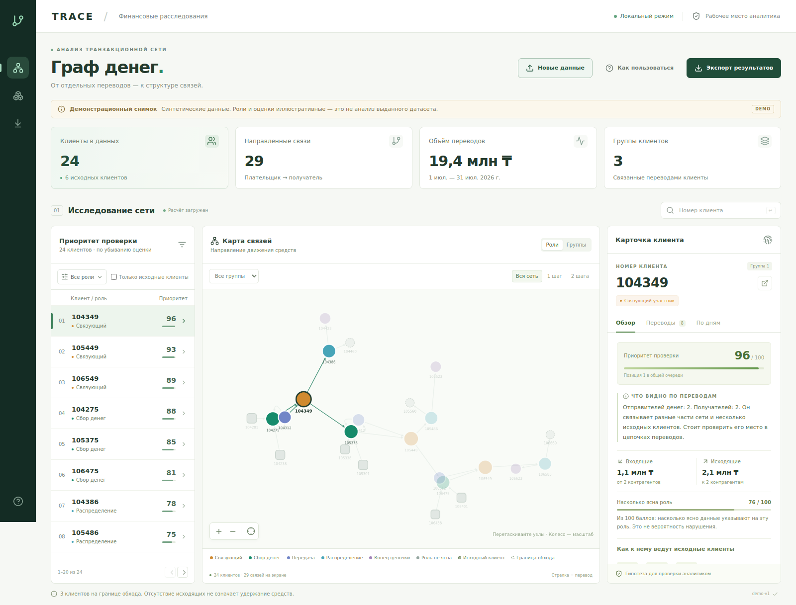
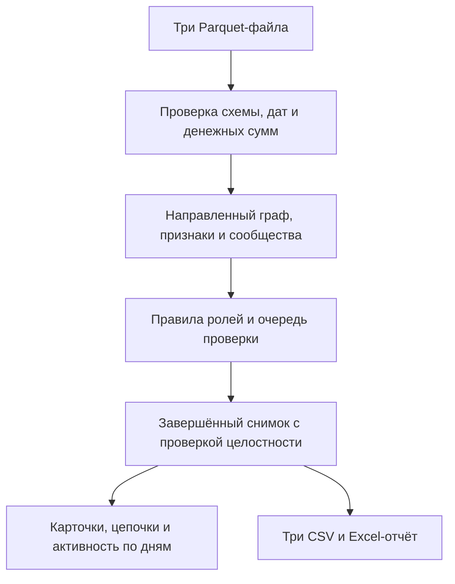

# TRACE · Граф денег

**От списка исходных клиентов — к объяснимой очереди финансового расследования.**

HackAlem AI · трек «Финансы» · кейс Freedom.

TRACE помогает AML-аналитику банка ответить на три вопроса: **кого проверить первым, почему именно его и какими переводами это подтверждается**. Приложение принимает три Parquet-файла, восстанавливает направленную сеть, предлагает роли участников и группы связей, показывает основания приоритета и выпускает отчёты.

**Для проверки не нужны GPU, графовая СУБД, API-ключи или платные сервисы.** После установки приложение работает локально на CPU. Предполагаемая роль — гипотеза для проверки человеком, а не заключение о нарушении.

> **Текущая объединённая версия:** ветка `codex/api-ui`. В неё уже включены данные и граф, скоринг и CLI, интерфейс, дневная активность, полные цепочки и этот README. Код приложения проверен на `137f4c3`; README принят коммитом `7d894d5`. Команды ниже загружают существующую ветку `codex/api-ui`. Начальная ветка `main` пока не содержит приложение. После финального объединения тимлид обновит здесь название ветки и проверенный коммит.

[Запустить](#запуск-с-чистого-компьютера) · [Демо за 5 минут](#сценарий-проверки-за-5-минут) · [Как считаем](#как-получаются-роли-и-приоритет) · [Отличия](#почему-наш-подход-полезен) · [Проверки](#что-проверено)



*Скриншот работающего приложения на встроенных синтетических данных. Это демонстрация интерфейса; результаты настоящего расчёта приведены отдельно ниже. Исходные данные кейса в репозитории не публикуются.*

## Проблема и ценность

В кейсе аналитик начинает с 81 исходного клиента, а выгрузка содержит 2 248 участников. Чтобы понять структуру связей, приходится сопоставлять входящие и исходящие операции, переходить между контрагентами, искать места сбора и распределения средств. Большой граф без объяснений эту работу не завершает.

TRACE объединяет последовательность действий в одном рабочем месте:

1. **Выбрать направление проверки:** очередь клиентов по рассчитанному приоритету.
2. **Понять причину:** роль-гипотеза, числовые факты, слагаемые оценки и ограничения.
3. **Проверить связи:** полная сохранённая цепочка от исходного клиента и конкретные операции.
4. **Посмотреть время:** поступления и отправления по дням за весь период.
5. **Передать результат:** три CSV по ТЗ и дополнительный Excel с русскими пояснениями.

На выданном наборе найден структурный пример: **13 плательщиков → один клиент → 1 получатель**. Другой клиент отправляет средства **116 получателям**. TRACE позволяет перейти от этих наблюдений к связям и операциям. Наличие такой структуры само по себе не доказывает противоправную деятельность.

Ожидаемый эффект — меньше ручных переходов между таблицами и более последовательная проверка гипотез. Экономия рабочего времени и точность выявления нарушений требуют пилота с аналитиками; мы не выдаём их за уже измеренные показатели.

## Что реализовано

| Возможность | Что получает аналитик |
|---|---|
| Загрузка через браузер | Выбор трёх Parquet и периода; проверка, расчёт и открытие результата |
| Очередь проверки | Все клиенты с приоритетом, фильтрами ролей/исходных клиентов; отдельный экспорт топ-30 |
| Карточка клиента | Простое объяснение, входящие/исходящие суммы, контрагенты, поддержка роли и подробности правил |
| Карта связей | Направленные стрелки, окраска по ролям или сообществам, поиск точного ID, окрестность в 1–2 шага |
| Полная цепочка | Отдельный просмотр сохранённого пути до четырёх переводов без обрезки окрестностью; суммы и количества на связях |
| Активность по дням | Полная история клиента, нулевые дни, точная таблица; различаются отсутствующая история и известное отсутствие операций |
| Сообщества | Состав, исходные клиенты, внутренние и межгрупповые потоки, гипотеза назначения |
| Экспорт | Обязательные CSV и Excel с листами «Как читать», «Клиенты», «Группы», «Проверить сначала» |
| Повторная проверка | Завершённый снимок расчёта с параметрами, версиями, исходными хешами и проверкой целостности |

При ошибке импорта предыдущий успешно загруженный результат сохраняется. Демо включается только явно; приложение не подменяет ошибку настоящего расчёта синтетическими данными.

## Почему наш подход полезен

Наша сильная сторона — **готовый локальный сценарий именно для неполной четырёхшаговой выгрузки Freedom**, от проверки исходных сумм до объяснения и выгрузки результата.

| Решение или подход | Что оно даёт | Отличие TRACE в этом кейсе |
|---|---|---|
| Таблицы и ручное сопоставление | Просмотр и фильтрацию отдельных операций | Связи, группы, роли и очередь рассчитываются вместе; из карточки можно перейти к пути и операциям |
| Neo4j Bloom | Универсальное исследование данных в графовой базе, поиск и визуальные действия | Наш сценарий запускается из Parquet без подготовки Neo4j и запросов аналитиком; правила кейса и три требуемых CSV уже включены |
| Linkurious | Графовые расследования, дела, комментарии, назначения и статусы | Мы предлагаем компактный однопользовательский MVP для конкретного набора; полноценного командного управления делами у нас пока нет |
| i2 Analyst’s Notebook | Развитый анализ связей, событий и временных последовательностей | Мы сфокусированы на воспроизводимом расчёте заданных ролей и ограничений выгрузки; не заявляем замену универсальной системе расследований |

Сравнение относится к назначению и организации работы, а не к качеству детекции или производительности: общего бенчмарка с этими продуктами мы не проводили. Официальные источники: [Neo4j Bloom](https://neo4j.com/docs/bloom-user-guide/current/bloom-installation/bloom-prerequisites/), [Linkurious](https://doc.linkurious.com/user-manual/latest/alert-investigate/), [i2](https://i2group.com/solutions/i2-analysts-notebook).

**Практические преимущества нашей реализации:**

- **Учитываем границу наблюдения.** Клиент на четвёртом колене не становится «конечным получателем» только из-за отсутствия исходящих. Изоляты сохраняются.
- **Показываем, откуда взялась оценка.** Доступны критерии роли, альтернативные кандидаты, ограничения поддержки и четыре вклада в приоритет.
- **Сохраняем финансовую точность.** Расчёт в целых тиынах; в API деньги и ID — строки, в Excel длинные ID — текст. Повторные операции не удаляются.
- **Связываем объяснение с проверкой.** Полный путь, операции и дневная активность доступны из карточки одного клиента.
- **Сохраняем согласованность результата.** Карточки и экспорты относятся к одному `run_id`; обязательные CSV выдаются из проверенного снимка без пересборки по текущим фильтрам.
- **Не требуем отправки данных в облако.** Основной расчёт и интерфейс не используют внешние API или CDN.

## Запуск с чистого компьютера

### 1. Что понадобится

- **Python 3.12.x, 64-bit.** Python 3.11 и 3.13+ не входят в объявленный диапазон проекта.
- Git для клонирования **или** ZIP-архив репозитория.
- Современный браузер на компьютере. Для проверки используется Chrome/Chromium; интерфейс рассчитан прежде всего на ноутбук.
- Интернет для получения кода и установки зависимостей. После установки основные функции работают локально.

**Node.js, pnpm, Docker, GPU и ключи AI для запуска не нужны:** готовый frontend лежит в `frontend/dist`. Дополнительные настройки `.env` не требуются.

Для Windows/macOS доступны [официальные установщики Python 3.12](https://www.python.org/downloads/release/python-31210/). Git: [инструкция установки](https://git-scm.com/downloads). После установки откройте новое окно терминала.

Для чистой **Ubuntu 24.04** можно установить необходимые системные пакеты:

```bash
sudo apt update
sudo apt install -y git python3.12 python3.12-venv
```

На другом Linux способ установки Python 3.12 зависит от дистрибутива. Не заменяйте системный Python глобально.

### 2. Получить проверяемую версию

В терминале выполните:

```bash
git clone --branch codex/api-ui https://github.com/BAITC-Hacks/hack-6d0b8f9a-dofp.git moneygraph
cd moneygraph
```

Репозиторий команды требует предоставленного GitHub-доступа. Если видите `Repository not found` или ошибку авторизации, проверьте аккаунт и доступ у команды/организаторов. Обычный пароль GitHub не используется для Git-операций; не вставляйте токены в команды или переписку.

**Без Git:** откройте ветку `codex/api-ui` в GitHub → **Code → Download ZIP**, распакуйте архив и откройте терминал в папке, где находятся `README.md`, `pyproject.toml`, `moneygraph/` и `frontend/`.

Все дальнейшие команды выполняются **из этой папки**. Активация окружения не нужна: команды явно используют его Python. Это также обходится без изменения политики выполнения PowerShell.

### 3. Установить и открыть демо без датасета

**macOS / Linux:**

```bash
python3.12 --version
python3.12 -m venv .venv
.venv/bin/python -m pip install ".[serve]"
.venv/bin/python -m pip check
.venv/bin/python -m moneygraph.api --demo
```

**Windows PowerShell:**

```powershell
py -3.12 --version
py -3.12 -m venv .venv
.\.venv\Scripts\python.exe -m pip install ".[serve]"
.\.venv\Scripts\python.exe -m pip check
.\.venv\Scripts\python.exe -m moneygraph.api --demo
```

Откройте **http://127.0.0.1:8000**. Терминал должен оставаться открытым. Ожидаются 24 синтетических клиента, граф и заметный баннер «Демонстрационный снимок». Роли демо заданы для показа интерфейса; их нельзя использовать как доказательство качества анализа.

Остановка сервера — **Ctrl+C** в его терминале. Если порт занят, добавьте `--port 8001` к команде запуска и откройте http://127.0.0.1:8001.

### 4. Проверить настоящий датасет через интерфейс

Получите у организаторов три файла одного набора: `nodes.parquet`, `edges.parquet`, `transactions.parquet`. Они намеренно не включены в Git. Для полноценной проверки расчёта нужен этот набор; встроенного демо достаточно только для знакомства с интерфейсом.

В уже открытом приложении:

1. Нажмите **«Новые данные»**.
2. Выберите одновременно все три Parquet-файла. Если в архиве есть вложенная папка `data`, выбирайте файлы именно из неё.
3. Для набора кейса укажите **01.07.2026–31.07.2026**.
4. Нажмите **«Загрузить и рассчитать»** и дождитесь завершения.
5. Проверьте, что баннер DEMO исчез, а число клиентов стало **2 248**.

Можно начать сразу с пустого приложения: замените `--demo` на `--empty` в команде запуска. Загрузка локальная. XLSX и CSV на вход не поддерживаются. Указанный период должен охватывать все операции: он не служит фильтром, автоматически отбрасывающим неподходящие строки.

### 5. Один запуск от Parquet до CSV и интерфейса — основной сценарий ТЗ

Положите три файла в папку `data` в корне проекта. Проверьте, что путь до первого файла — `data/nodes.parquet`, а не `data/data/nodes.parquet`. Остановите предыдущий сервер через Ctrl+C.

**macOS / Linux:**

```bash
.venv/bin/python -m moneygraph run --data ./data --out ./out --serve
```

**Windows PowerShell:**

```powershell
.\.venv\Scripts\python.exe -m moneygraph run --data ./data --out ./out --serve
```

Откройте http://127.0.0.1:8000. Команда печатает `run_id`, каталог результатов и время расчёта. Без `--serve` она только рассчитывает и сохраняет результат, затем завершается. Данные можно хранить вне проекта: замените `./data` на свой путь в кавычках.

Период по умолчанию — июль 2026. Для совместимого набора другого периода добавьте `--period-start YYYY-MM-DD --period-end YYYY-MM-DD`. Параметры кластеризации: `--resolution 1.0 --seed 42`; размер топа: `--top-limit 30`.

### 6. Открыть сохранённый результат без пересчёта

После пакетного запуска последний `run_id` записан в `out/current.json`.

**macOS / Linux:**

```bash
run_id=$(.venv/bin/python -c 'import json; print(json.load(open("out/current.json"))["run_id"])')
.venv/bin/python -m moneygraph.api --snapshot "./out/runs/$run_id"
```

**Windows PowerShell:**

```powershell
$runId = (Get-Content .\out\current.json | ConvertFrom-Json).run_id
.\.venv\Scripts\python.exe -m moneygraph.api --snapshot ".\out\runs\$runId"
```

Для расчёта, загруженного через браузер, используйте каталог `out/imports/runs/<run_id>`: его ID виден в интерфейсе. В `--snapshot` передаётся **папка конкретного завершённого расчёта**, а не файл-указатель `current.json`.

## Сценарий проверки за 5 минут

После установки и расчёта настоящего набора:

| Время | Действие жюри | Что проверяется |
|---|---|---|
| 0:00–0:40 | Посмотреть сводку: 2 248 клиентов, 3 119 связей, 105 групп | Загружен настоящий расчёт, а не демонстрационный экран |
| 0:40–1:40 | Открыть клиента из очереди; прочитать «Что видно по переводам» и «Подробности расчёта» | Приоритет и роль имеют основания; это разные оценки |
| 1:40–2:40 | Найти клиента по полному ID; открыть «Показать цепочку на графе» у сохранённого примера | Направления, участники и весь путь видны; можно вернуться к сети |
| 2:40–3:30 | Переключить «Переводы» и «По дням», раскрыть точную таблицу | Объяснение связано с операциями и историей за весь период |
| 3:30–4:15 | Посмотреть группу и предупреждения клиента на четвёртом колене или изолята | Ограничения выгрузки не превращаются в ложный уверенный вывод |
| 4:15–5:00 | «Экспорт результатов»: скачать Excel и три CSV | Результат пригоден для дальнейшей проверки и соответствует схемам ТЗ |

Для воспроизводимых примеров команда подготовила локальный подбор пяти сценариев: сбор, распределение, связь нескольких исходных клиентов, четвёртое колено, изолят.

macOS/Linux:

```bash
.venv/bin/python tests/graph/review_graph.py --data ./data --out ../moneygraph-defense-local
```

Windows:

```powershell
.\.venv\Scripts\python.exe tests/graph/review_graph.py --data ./data --out ../moneygraph-defense-local
```

В `demo-scenarios.local.json` — выбранные ID, ожидаемые факты и шаги; в `stability.json` — чувствительность кластеров. Выбор делается по данным, ID не зашиты в правила. Для повторного запуска выберите новый `--out`: отчёты не перезаписываются. Не добавляйте эти локальные файлы в Git.

## Как читать результаты

| Термин | Значение |
|---|---|
| Клиент / узел / gid | Участник сети и его исходный идентификатор |
| Исходный клиент / seed | Точка, от которой организаторы собирали исходящие связи |
| Стрелка | Перевод от плательщика к получателю; одна связь может объединять несколько операций |
| Глубина / depth | Шаг обнаружения при выгрузке, а не должность участника |
| Сообщество / группа | Структурная группа связанных клиентов, не доказанная организованная группа |
| Приоритет | Кого полезнее проверить раньше по выбранной формуле |
| Поддержка роли | Насколько признаки поддерживают роль с учётом ограничений |
| Сохранённый путь | Пример направленной связи от исходного клиента; не доказательство перемещения одной суммы |

В CSV оценки лежат в диапазоне **0–1**, в интерфейсе и Excel показываются как **0–100**. Ни одна из этих шкал не является вероятностью преступления. Все суммы в интерфейсе — KZT. Разница поступлений и отправлений не равна остатку счёта.

## Как получаются роли и приоритет

### От входных данных к объяснению



1. **Проверяем вход.** Уникальность клиентов и пар рёбер, существование концов связей, типы, период, суммы и согласованность агрегированных рёбер со всеми операциями. При расхождении расчёт останавливается.
2. **Строим ориентированный граф.** Изолированные клиенты и повторные операции сохраняются. Суммы переводятся в целые тиыны.
3. **Считаем признаки.** Плательщики/получатели, суммы, число операций и активных дней, PageRank, betweenness, достижимость от разных исходных клиентов, примеры путей до четырёх шагов.
4. **Находим сообщества.** Louvain внутри слабосвязных компонент, на неориентированной проекции с весом суммы встречных направлений; `resolution=1.0`, `seed=42`. Изоляты образуют отдельные группы.
5. **Применяем объяснимые правила.** Сохраняем принятые и отклонённые кандидаты, ограничения и вклад каждого фактора в приоритет.
6. **Публикуем целый результат.** Снимок включает параметры, версии и SHA-256 артефактов. API использует проверенный результат, а не отдельный повторный скоринг.

### Шесть ролей

`in_degree/out_degree` — разные плательщики/получатели без самого клиента. Самопереводы входят в денежные суммы и число операций. Для допуска роли также нужна поддержка правила не ниже 0,5.

| Код роли | Понятное название | Основной критерий допуска по умолчанию |
|---|---|---|
| `consolidator` | Сбор денег | Не менее 3 плательщиков; их минимум вдвое больше получателей либо достижимы связи от минимум 2 исходных клиентов |
| `distributor` | Распределение денег | Не менее 5 получателей и минимум вдвое больше, чем плательщиков |
| `transit` | Передача дальше | Есть вход и выход, отношение наблюдаемого выхода ко входу 0,8–1,2; не исходный и не граничный клиент |
| `terminal` | Возможный конец цепочки | Есть вход, нет исходящих операций, глубина меньше 4, не исходный клиент; последнее поступление минимум за 2 дня до конца периода |
| `coordinator` | Связующий участник | Достижим от минимум 2 исходных клиентов; есть вход и выход, высокий betweenness и связи минимум с 2 другими сообществами |
| `peripheral` | Роль не определена | Ни один кандидат не прошёл правила; это не признак безопасности |

При сравнении чисел контрагентов нулевой знаменатель заменяется на 1. Для `terminal` также должны быть известны число дней поступлений и дата последнего входа. «Высокий betweenness» означает процентиль не ниже 0,9 среди положительных значений. Точные формулы поддержки, разрешение равенств и ограничения оценок опубликованы в [правилах скоринга](docs/scoring.md).

**Приоритет = 0,35 × S + 0,25 × M + 0,25 × B + 0,15 × V**, где S — нормированное число достижимых исходных клиентов, M — поддержка принятой роли, B — процентиль betweenness, V — процентиль максимума наблюдаемого входящего/исходящего объёма. При равенстве приоритета первым идёт меньший ID.

Приоритет использует поддержку сигнала до ограничений уверенности в конкретном ярлыке. Поэтому клиент может заслуживать ранней проверки при неоднозначной роли. Это явный методический выбор: замена поддержки на ограниченную оценку меняет 13 из 20 участников топа. [Проверка чувствительности](docs/scoring-sensitivity.md) описывает последствия; мы не скрываем эту зависимость.

## Результаты на предоставленном наборе

| Показатель | Результат |
|---|---:|
| Клиентов / исходных клиентов | 2 248 / 81 |
| Направленных связей / отдельных операций | 3 119 / 4 840 |
| Сумма наблюдаемых переводов | 365 890 012,01 KZT |
| Сообществ при настройках по умолчанию | 105 |
| Клиентов в `nodes_roles.csv` / строк в `top_nodes.csv` | 2 248 / 30 |
| Сохранённых изолятов | 19 |
| Клиентов на глубине 4 | 444 |
| Сохранённых повторных строк операций | 97 |
| Сохранённых примеров путей / из них четырёхшаговых | 3 800 / 1 311 |

Сумма по графу — оборот всех наблюдаемых переводов, не объём уникальных денег и не сумма незаконных средств. Слабосвязных компонент 35 с учётом 19 изолятов, или 16 без них.

При `resolution=0.8/1.0/1.2` получены **99/105/123** сообщества. ARI относительно разбиения 1.0 — **0,942 / 1,000 / 0,883**. Это проверка чувствительности к масштабу группировки при фиксированном seed, не доказательство истинности состава групп. [Методология и воспроизведение](docs/graph-methodology.md).

Размеченных истинных ролей нет. Accuracy, precision и recall на этом наборе не заявляются. Воспроизводимость и прохождение тестов доказывают согласованность реализации, но не правильность всех AML-гипотез.

## Файлы результата

После пакетного запуска: `out/runs/<run_id>/`. `out/current.json` указывает на последний завершённый расчёт.

| Файл | Содержимое |
|---|---|
| `nodes_roles.csv` | `gid, role, role_score, cluster_id, priority_score, evidence` — все клиенты, объяснение до 200 символов |
| `clusters.csv` | `cluster_id, n_nodes, n_seed, sum_kzt_internal, top_gids, hypothesis` |
| `top_nodes.csv` | `rank, gid, role, priority_score, why` — первые 30 клиентов по умолчанию |
| `features.parquet` | Полные рассчитанные признаки |
| `transactions.parquet` | Нормализованные операции, включая повторы и ссылки на исходные строки |
| `explanations.jsonl` | Подробные правила, кандидаты, ограничения и вклады в приоритет |
| `graph.json` | Клиенты, направленные связи и результаты анализа |
| `quality.json` | Сверки и ограничения данных |
| `manifest.json` | Параметры, версии, идентификатор расчёта и хеши артефактов |

Excel формируется по кнопке **«Экспорт результатов → Открыть в Excel — рекомендуется»**. Он дополняет обязательные CSV, не заменяя их. Для CSV в Excel импортируйте ID клиента как **текст**: автоматическое распознавание длинных чисел может изменить последние цифры.

## Данные, технологии и AI

**Данные:** обезличенный набор организаторов, внутрибанковские исходящие связи на четыре колена за 1–31 июля 2026, операции от 5 000 KZT. Внешнего обогащения нет. Схема входа:

| Файл | Обязательные поля |
|---|---|
| `nodes.parquet` | `gid` int64, `depth` целое 0–4, `is_seed` bool |
| `edges.parquet` | `src, dst` int64, `sum_kzt`, `n_tx` целое, `depth` 1–4 |
| `transactions.parquet` | `src, dst` int64, `date` дата без времени, `sum_kzt` |

Входные суммы положительные, в KZT, с точностью не более двух десятичных знаков. Пары и агрегаты операций должны совпадать с `edges`. Изменение периода не позволяет автоматически использовать произвольную выгрузку другой схемы.

**Стек:** Python 3.12, pandas 2.2.3, PyArrow 25.0.1, NumPy 2.3.5, NetworkX 3.7, SciPy 1.17.0; FastAPI 0.141.1, Uvicorn 0.53.0, Pydantic 2.13.5; React, TypeScript, Vite и Cytoscape.js. Основные Python-версии закреплены в `pyproject.toml`, frontend — в `frontend/pnpm-lock.yaml`.

**AI в разработке:** команда использовала Codex для реализации, тестирования и проверки решений. Основной продукт выполняет графовые алгоритмы и объяснимые правила, а не вызов LLM и не обученную модель классификации.

**Отдельное развитие:** [AI-помощник](https://github.com/BAITC-Hacks/hack-6d0b8f9a-dofp/tree/codex/ai-assistant) реализован в отдельной ветке как backend-модуль объяснения фактов со ссылками на их источники. В его конфигурации предусмотрен профиль OpenAI. В описанной здесь сборке он ещё не подключён к API/UI, поэтому кнопка AI и качество реальных ответов модели не заявляются. Для обязательного сценария ТЗ он не требуется: AI-ассистент указан в опциональных функциях. Перед включением нужны подтверждение допустимости внешней передачи и доступа командного API-проекта, интеграция интерфейса и приёмка на настоящей модели. Основной сценарий работает при выключенном AI.

## Что проверено

Проверка выполнена в новом Python-окружении без системных Python-пакетов и без дополнительного PYTHONPATH. Установлен проект с зависимостями из репозитория, выполнены pip check, расчёт, автоматические проверки, настоящий HTTP-запуск и проверка браузера. Детальный протокол и границы проверки — [docs/jury-verification.md](docs/jury-verification.md).

| Среда | Статус |
|---|---|
| Ubuntu 24.04.3 x86_64, Python 3.12.14 | Установка, полный расчёт, API, тесты и браузер проверены при подготовке README |
| Windows x64 | Командный запуск описан в [протоколе C](docs/ui.md); дополнительно проверен подбор всех бинарных зависимостей Python 3.12 |
| macOS 12+ Apple Silicon / Intel | Проверен подбор бинарных зависимостей Python 3.12; полный запуск интерфейса на этих ОС в этой проверке не выполнялся |

В проверяемой сборке прошли **165 тестов и 36 подслучаев** с подключёнными настоящими данными и файловым снимком. В Chromium проверены граф, карточка, полная цепочка, дневная активность, операции, Excel и загрузка настоящих Parquet; ошибок JavaScript не обнаружено.

Контрольный Linux-прогон объединённой сборки завершил полный расчёт за **2,346 с**. В Windows-прогоне команды — **8,563 с**. Оба замера исключают установку и открытие браузера; они не гарантируют время любого компьютера. Требование ТЗ — менее пяти минут на выданном объёме.

Мы не обещаем запуск на любой ОС, телефоне, 32-битном устройстве или произвольной версии Python. Приведённые инструкции относятся к указанным настольным средам.

### Автоматическая проверка

Для обычных тестов установите дополнительные зависимости и запустите:

macOS/Linux:

```bash
.venv/bin/python -m pip install ".[serve,dev]"
.venv/bin/python -m pytest -q
```

Windows:

```powershell
.\.venv\Scripts\python.exe -m pip install ".[serve,dev]"
.\.venv\Scripts\python.exe -m pytest -q
```

Без переменных окружения проверки выданного набора пропускаются. Для полной приёмки сначала выполните пакетный запуск с `--data ./data --out ./out`, затем:

macOS/Linux:

```bash
export MONEYGRAPH_DATA_DIR="$PWD/data"
export MONEYGRAPH_API_TESTS=1
run_id=$(.venv/bin/python -c 'import json; print(json.load(open("out/current.json"))["run_id"])')
export MONEYGRAPH_SNAPSHOT_DIR="$PWD/out/runs/$run_id"
.venv/bin/python -m pytest -q
```

Windows PowerShell:

```powershell
$env:PYTHONUTF8 = "1"
$env:MONEYGRAPH_DATA_DIR = (Resolve-Path .\data).Path
$env:MONEYGRAPH_API_TESTS = "1"
$runId = (Get-Content .\out\current.json | ConvertFrom-Json).run_id
$env:MONEYGRAPH_SNAPSHOT_DIR = (Resolve-Path ".\out\runs\$runId").Path
.\.venv\Scripts\python.exe -m pytest -q
```

Тесты сверяют суммы, роли и ограничения, все карточки настоящего снимка, направления путей, повторные операции, дневную активность, импорты и соответствие экспортов. Реальный HTTP-тест использует отдельный свободный локальный порт.

## Если запуск не получился

| Симптом | Что сделать |
|---|---|
| `python3.12` или `py` не найден | Установить Python 3.12, открыть новый терминал и проверить версию. На macOS при сбое Homebrew Python использовать официальный установщик |
| Ошибка версии Python при pip install | Создать окружение именно Python 3.12, а не системным 3.11/3.13 |
| `venv` / `ensurepip` отсутствует на Ubuntu | Установить пакет `python3.12-venv`, затем заново создать окружение |
| `ModuleNotFoundError` | Использовать Python из `.venv` и повторить `-m pip install ".[serve]"` из корня проекта |
| `data/nodes.parquet` не найден | Распаковать данные; проверить отсутствие лишнего уровня `data/data`; передать правильную папку через `--data` |
| Период или суммы не проходят проверку | Использовать три файла одного набора и период, охватывающий все операции; не удалять строки для обхода сверки |
| Адрес не открывается | Убедиться, что сервер ещё работает; открыть именно `http://127.0.0.1:8000`, без HTTPS |
| Порт занят | Добавить `--port 8001` и открыть адрес с этим портом |
| Frontend отсутствует / ответ 503 | Запускать из полного checkout с `frontend/dist`; при отдельной установке wheel передать `--static-dir` с абсолютным путём к этой папке |
| Не удаётся скачать зависимости | Проверить доступ к PyPI и интернет; офлайн-установка без заранее подготовленных пакетов не заявляется |
| Обновлён код, но поведение старое | Повторить установку `-m pip install ".[serve]"` и перезапустить сервер |
| ID клиента испортился в Excel | Использовать дополнительный XLSX-отчёт либо импортировать колонку ID из CSV как текст |

## Ограничения и дальнейшее развитие

- **Наблюдения неполные:** один месяц, один банк, порог 5 000 KZT, исходящий обход. Внешние потоки и меньшие суммы отсутствуют.
- **Четвёртое колено обрезано:** отсутствие выхода не доказывает удержания средств; вход исходных клиентов также неполон.
- **Роли — эвристики:** нет размеченной истины, статистической калибровки и автоматического юридического вывода. Пороговые правила требуют пилота.
- **Время — только день:** дневные суммы и структурные пути не доказывают мгновенный транзит или прохождение одной суммы через всю цепочку.
- **Локальный MVP:** браузерный импорт ограничен 40 МиБ на файл, 10 000 клиентов, 50 000 связей и 200 000 операций. Один импорт одновременно. Нет банковской интеграции и потокового мониторинга.
- **Визуализация ограничивает объём:** обычный граф показывает до 250 узлов; скрытая часть обозначается. Поиск работает по всему снимку, отдельный путь показывается целиком.
- **Нет командного управления делами:** статусы, ответственные, заметки, авторизация и аудит действий пользователей — следующие этапы. Сервер слушает loopback; публиковать его как банковский сервис без этих механизмов нельзя.
- **Хеши защищают согласованность:** они выявляют повреждение и рассогласование файлов, но не являются цифровой подписью.

Следующие шаги: пилот с AML-аналитиками и измерение времени проверки; калибровка правил на экспертной разметке; интеграция AI-объяснений с проверяемыми ссылками; сохранение заметок и статусов расследования; проверка устойчивости при изменении данных и масштабирование.

## Что изменится при росте до миллиона узлов

Это план масштабирования, предусмотренный ТЗ, а не заявление о поддержке такого объёма текущим MVP. Помимо числа узлов важны число рёбер, операций и исходных клиентов, а также размер крупнейшей компоненты. Простого увеличения лимита загрузки недостаточно.

| Участок | Изменение подхода |
|---|---|
| Загрузка и денежные сверки | Читать Parquet порциями и только нужные столбцы; агрегировать операции по частям, сохраняя точные суммы в целых тиынах и проверку итогов. Не держать исходные байты, таблицы и все копии графа одновременно в памяти |
| Представление графа | Перейти от Python-объектов NetworkX к компактным массивам и разреженному представлению; исходные int64 ID хранить отдельно от внутренних индексов |
| Центральности | Уже сейчас betweenness оценивается по `min(128, N)` источникам. На большом объёме выбирать размер выборки по бюджету времени и проверять устойчивость топа; PageRank считать над разреженным графом с явными условиями остановки |
| Достижимость и примеры путей | Сохранить смысл исходящего обхода до четырёх шагов; ограничивать число сохраняемых примеров, кэшировать востребованные пути. Неполный расчёт достижимости явно маркировать: его нельзя незаметно подставлять в скоринг как полный |
| Сообщества | Обрабатывать независимые компоненты параллельно в пределах памяти. Для одной большой компоненты использовать подходящий движок и измерять время отдельно; произвольное разрезание её на куски может изменить найденные группы |
| Хранение и API | Хранить результаты с индексами по клиенту, группе и приоритету; читать карточки и операции по запросу. Большой JSON и все операции не загружать целиком при каждом запуске сервера |
| Интерфейс | Сначала показывать агрегаты сообществ и очередь, затем раскрывать локальный подграф. Сохранять глобальный поиск, пагинацию и предупреждение об ограниченном отображении |

При переходе сохраняются контракты трёх CSV, объяснения правил, хеши и параметры снимка. Приёмка включает сверку сумм и количества строк, сравнение ролей и состава топа на контрольном наборе, оценку чувствительности сообществ и замеры времени/пиковой памяти при росте узлов **и рёбер**. Распределённую инфраструктуру следует добавлять только по результатам этих замеров. Требование текущего кейса «менее пяти минут» проверено на выданном наборе, на миллион узлов оно автоматически не переносится.

## Материалы проекта

- [Техническое задание Freedom](https://docs.google.com/document/d/1JPLU-G6R25Ge2hVaY2J9cqvrx7FGExj87XKwJPaMz3o/edit)
- [Качество данных](docs/data-quality.md) и [методология графа](docs/graph-methodology.md)
- [Правила ролей](docs/scoring.md) и [чувствительность очереди](docs/scoring-sensitivity.md)
- [Расчёт и снимки](docs/pipeline.md), [API и интерфейс](docs/ui.md)
- [Полные цепочки: контракт и проверки](tests/graph/PATH-EVIDENCE.md)
- [Проверка установки для жюри](docs/jury-verification.md)

Публичная развёрнутая версия не предоставляется: демонстрация запускается локально по инструкции выше. Исходные финансовые файлы, результаты с ID клиентов, API-ключи и пароли в репозиторий не включаются. Данные используются в рамках условий организаторов; в публичных иллюстрациях — только синтетическое демо.
